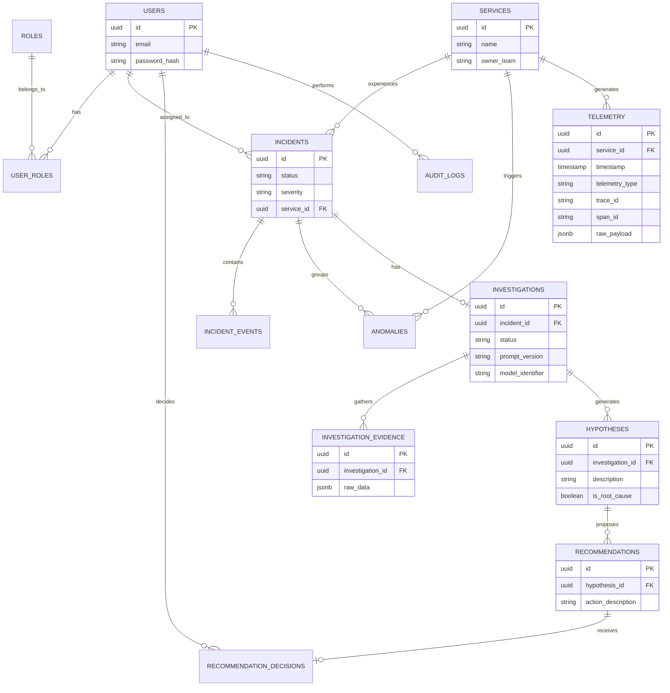

# Database Entity-Relationship Diagram

```mermaid
erDiagram
    USERS ||--o{ USER_ROLES : has
    ROLES ||--o{ USER_ROLES : belongs_to
    USERS ||--o{ INCIDENTS : assigned_to
    USERS ||--o{ RECOMMENDATION_DECISIONS : decides
    USERS ||--o{ AUDIT_LOGS : performs
    
    SERVICES ||--o{ INCIDENTS : experiences
    SERVICES ||--o{ ANOMALIES : triggers
    SERVICES ||--o{ TELEMETRY : generates
    
    INCIDENTS ||--o{ INCIDENT_EVENTS : contains
    INCIDENTS ||--o{ ANOMALIES : groups
    INCIDENTS ||--o| INVESTIGATIONS : has
    
    INVESTIGATIONS ||--o{ INVESTIGATION_EVIDENCE : gathers
    INVESTIGATIONS ||--o{ HYPOTHESES : generates
    
    HYPOTHESES ||--o{ RECOMMENDATIONS : proposes
    RECOMMENDATIONS ||--o| RECOMMENDATION_DECISIONS : receives

    USERS {
        uuid id PK
        string email
        string password_hash
    }
    SERVICES {
        uuid id PK
        string name
        string owner_team
    }
    TELEMETRY {
        uuid id PK
        uuid service_id FK
        timestamp timestamp
        string telemetry_type
        string trace_id
        string span_id
        jsonb raw_payload
    }
    INCIDENTS {
        uuid id PK
        string status
        string severity
        uuid service_id FK
    }
    INVESTIGATIONS {
        uuid id PK
        uuid incident_id FK
        string status
        string prompt_version
        string model_identifier
    }
    INVESTIGATION_EVIDENCE {
        uuid id PK
        uuid investigation_id FK
        jsonb raw_data
    }
    HYPOTHESES {
        uuid id PK
        uuid investigation_id FK
        string description
        boolean is_root_cause
    }
    RECOMMENDATIONS {
        uuid id PK
        uuid hypothesis_id FK
        string action_description
    }
```
