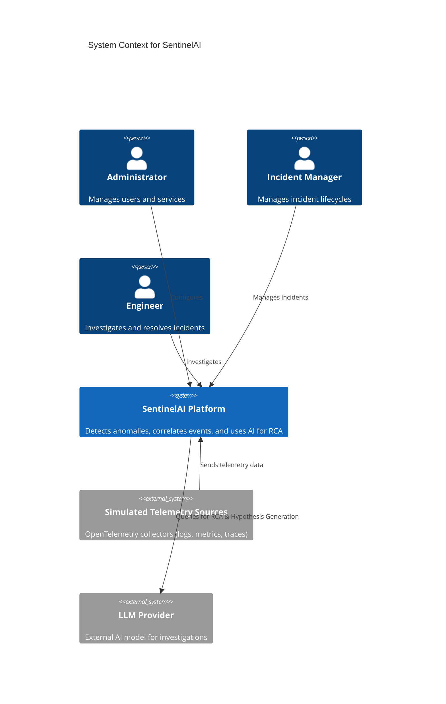

# System Architecture

## Architecture Overview
SentinelAI is built as a **Modular Monolith**. The architecture strictly separates concerns internally through logical boundaries while executing as a single runtime process (FastAPI) to reduce deployment and operational complexity during Phase 1.

## C4 System Context



## C4 Container Architecture

```mermaid
C4Container
    title Container Diagram for SentinelAI
    
    Container(spa, "Frontend SPA", "Next.js, TypeScript", "Provides the dashboard, incident workspace, and investigation UI")
    
    Container_Boundary(backend_monolith, "Backend Monolith") {
        Container(api, "FastAPI Backend", "Python", "Handles REST API, orchestrates modules")
        Container(worker, "Background Workers", "Celery/Arq + Redis", "Async tasks: anomaly detection, AI queries")
    }
    
    ContainerDb(db, "PostgreSQL", "Relational Database", "Stores users, incidents, metadata, and audit logs")
    ContainerDb(redis, "Redis", "In-Memory Store", "Caching, task queues, rate limiting")
    
    Rel(spa, api, "Makes API calls", "HTTPS/REST")
    Rel(api, db, "Reads/Writes", "SQL/SQLAlchemy")
    Rel(api, redis, "Enqueues tasks/caches", "Redis Protocol")
    Rel(worker, db, "Reads/Writes", "SQL/SQLAlchemy")
    Rel(worker, redis, "Dequeues tasks", "Redis Protocol")
    Rel(worker, llm_provider, "Generates RCA", "HTTPS/REST")
```

## Data Flow & Responsibilities
1. **Frontend → Backend**: All user interactions (Next.js) communicate via REST APIs to the FastAPI backend. Authentication is token-based (JWT).
2. **Synchronous vs Asynchronous**: 
   - **Sync**: CRUD operations (services, users, fetching incident data).
   - **Async**: Heavy operations like anomaly detection processing, telemetry correlation windows, and LLM inferences run in background workers (Redis-backed).
3. **Trust Boundaries**: The frontend is fully untrusted. All requests are authorized at the FastAPI API layer using RBAC policies.

## Major Architectural Decisions
- **PostgreSQL as Primary Store**: Handles relational data (users, incidents) and structured telemetry metadata.
- **Redis**: Serves as a message broker for background jobs and caching layer.
- **LLM Integration**: Abstracted behind an `ai` internal module to prevent vendor lock-in and allow structured parsing.
